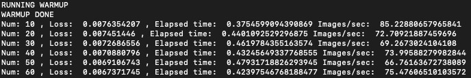
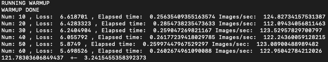

# keras_tf_benchmark
Performance benchmark for tf.Keras &amp; tf.slim

Run the benchmark test by 
```
python tf_benchmark --model=keras
```
You can swicth model graph from keras/slim by set the --model 

We can clearly see that ResNet-50 grpah by Keras is slower than slim on the same data loader.

Keras result


---
Tf slim result



